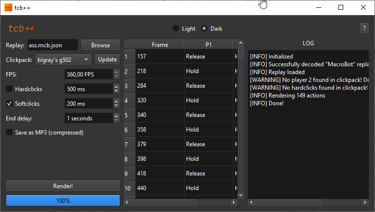

# TCB++
Supported macro types: ReplayBot, TasBot, EchoBot, Plain Text (frames)

## Quickstart
```shell
$ pip install -r requirements.txt
$ python main.py
```
## Clickpack folder structure
```
[clickpack name]
| 
+ softclicks (optional)
| |
| + 1.wav
| + 2.wav
| + 3.wav
+ hardclicks (optional)
| |
| + 1.wav
| + 2.wav
| + 3.wav
+ p1
| |
| + holds
| | |
| | + 1.wav
| | + 2.wav
| | + 3.wav
| + releases
|   |
|   + 1.wav
|   + 2.wav
|   + 3.wav
+ p2 (optional)
  |
  + holds
  | |
  | + 1.wav
  | + 2.wav
  | + 3.wav
  + releases
    |
    + 1.wav
    + 2.wav
    + 3.wav
```
Example in `clickpacks` folder ~~(its outdated and dont work sowwy)~~ it works now

## Gallery


## Links
[TobyAdd's Discord](https://discord.com/invite/mQHXzG72vU)
